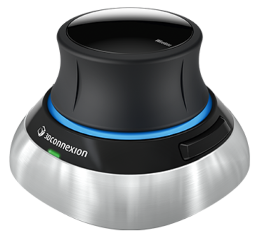

# SpaceMouse driving Home Assistant controls

I've been looking for quite some time for a physical device that could easyly change various volumes controls of a large 7.1 home theater installation 
as Main volume, Center volume, SubWoofer for instance. Using phone or tablet is definitely not as handy.

[SpaceMouse Wireless](https://3dconnexion.com/us/product/spacemouse-wireless/) device turns out to be very convevient to achieve that goal.


I share here what I put together to get it running in a Windows environment, it should be fairly easy to make it running on Linux systems as well.

## Installation of various modules

- Python 3 has to be installed on the target machine
- Install [pyspacemouse](https://pypi.org/project/pyspacemouse/) Python library as described in the related page
- Create a folder where spaceMouse.py shall be copied
- As it is explained, there is no need to install any specific driver, as far as Windows goes just copy hidapi.dll in a folder inside the spaceMouse.py folder. Doing so you will not run into headaches to make the dll recognized when the python program references it.
- Install easyhid as instructed
- Make sure you have a MQTT broker running. There are plenty of tutorials, I won't detail here how to do it. I've been running a Mosquito broker for several years now on a separete RPi3B with any hiccup.
- Install [paho-MQTT](https://pypi.org/project/paho-mqtt/) which is the python MQTT library
- Modify spaceMouse.py MQTT broker parameters depending on your specific setup
- Depending on the exact device used, it may be needed to modify the open call. I did many tries before to find the correct one.

```python
    success = pyspacemouse.open(dof_callback=send2MQTT, button_callback=send2MQTTbutton,
                            button_callback_arr="", device="3Dconnexion Universal Receiver", DeviceNumber=3)
```

- Make the program run at boot time. There are several solutions depending on the OS. For Windows, I find it easy do it with the task scheduler. Create a bash script and make it run at boot time (before user logs to the machine)

```bash
python "C:\Users\yourfolder\spacemouseHA.py"
```

- Install in HA environement (see yaml files)
  - Definition of 2 input buttons
  - Definition of 4 input numbers
  - Create a card in order to display the helpers
  - And the automation that will process MQTT data

As a test, spaceMouse.py may be started manually to see how things are going. Acting on the various control buttons should make the various helpers changing. In order to adapt the mouvement to your likingd, you may change some constants in spacemouse.py
